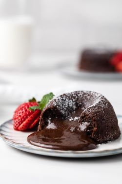

# Lavacake Recept

## Benodigdheden
* 175 gram roomboter (ongezouten)
* 175 gram pure chocolade
* 75 gram suiker
* 75 gram bloem
* 3 eieren
* 2 eidooiers
* Vanille extract (paar druppels)
* Zout

### Bereiding
1. Verwarm de oven voor op 220 graden.
2. Doe de eieren en de eidooiers in een ruime kom of keukenmachine samen met de suiker en klop ze vervolgens ongeveer 5 minuten op tot je een luchtige en wit gele massa hebt.
3. Ondertussen smelt je de boter, chocolade en een paar druppels vanille extract au-bain-marie of in de magnetron.
4. Als de boter en chocolade gesmolten zijn haal je deze van het vuur en spatel je beetje bij beetje voorzichtig het eigeel en suiker mengsel erdoor.
5. Tot slot spatel je de bloem en een snuf zout erdoor tot je een mooi, lobbig beslag hebt.
6. Vet de ramekins in met een beetje boter en bedek het bakje met een beetje cacaopoeder zodat je de cake er makkelijk uit krijgt na het bakken. Ik gebruik expres cacaopoeder hiervoor omdat bloem een wittige waas kan achterlaten op het cakeje.
7. Zet de ramekins vervolgens in de oven voor ongeveer 13 minuten. Haal ze daarna uit de oven en leg een schaaltje op de ramekin, draai om en het cakeje stort je op deze manier op het schaaltje.
8. Serveer met een beetje poedersuiker, een bolletje vanille-ijs erbij, een toefje slagroom of wat rood fruit. Eet smakelijk!

Recept: [Lava Cake Recept]

[Lava Cake Recept]: https://www.eefkooktzo.nl/chocolade-lava-cake/